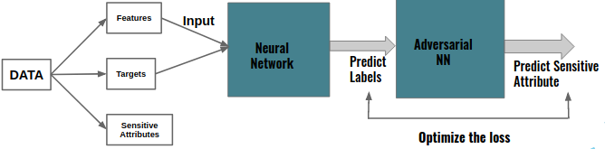

# FairClassifier

**Machine Learning** models are extensively used for the purpose of determining access to services such as eligibility for loans, insurance etc. 

With the growing impact and efficient results of Machine Learning and AI, transparency and fairness in the predictions of the models is of a major concern.
Unintentional discrimination made by Machine Learning results affects the lives of people with certain sensitive characteristics. The sensitive characteristics might be sex, age or color.
This flaw of unintentional discrimination caused by the source data has not been fully addressed though.
 

**Fair Classifier** is an open source package that evaluates the fairness of a Neural Network. 
It is a command-line tool in which the user can check the fairness of the model against different sensitive attributes from the training dataset.

### Fairness metrics implemented
> The fairness contraint P% rule is based on [this paper.](https://arxiv.org/pdf/1507.05259.pdf)

### Mitigation approach
It is common to think that simply removing sensitive attribute from the training data might be able to solve the problem of biasness.
However, results obtained by training our Neural Network shows that this is not the case.

> The basic idea is to attach a neural network  with an adversarial network to help mitigate the bias. For further reading please follow this [Link.](https://blog.godatadriven.com/fairness-in-ml)

The detailed architecture is shown below.

## Architecture
The overview of the architecture of the model is shown in this figure below:

The system of training two Neural Network might look similar to the one used for training [GANS.](https://arxiv.org/abs/1406.2661) 
However, it is not the case. 

First, the generative model used in GANs is replaced by a predictive model which 
instead of generating synthetic data gives actual predictions from the input data.
Second, adversarial network doesn't distinguish real data from generated synthetic data in this case. 
However, it tries to predict the sensitive attribute values from the predicted labels from the earlier Neural Network.
Both of these networks train simultaneously with an objective to optimize the prediction losses of prediction labels and sensitive attributes. 

 

## Setup
Follow these steps for installation.

### Manual Installation
Clone this repository.

To run the example script, install the additional libraries specified in requirements.txt file as above:

Then change your directory to the Project directory.

Currently, this package works only with 2 sensitive attribute of the dataset i.e race and sex.

The below example is to check the fairness of the model for race attribute.

Steps:

`git clone git@github.com:suraz09/FairClassifier.git`

`cd FairClassifier`

`pip install -r requirements.txt`

`python src/notebooks/main.py race African-American`

## Motivation
This project is inspired by this [Blog.](https://blog.godatadriven.com/fairness-in-ml) 

## Pre-Requisites
`python`

I have used `AWS` cloud services for faster training of the model.

### DataSet
The [Dataset](https://raw.githubusercontent.com/propublica/compas-analysis/master/compas-scores-two-years.csv) used in this project 
was acquired, analyzed and released by [Propublica.](https://github.com/propublica/compas-analysis) It consists of ~12k records of criminals of Broward County. 

Using this dataset, the model predicts how likely a criminal defendant is to reoffend.
Recidivism is defined as a new arrest within two years in the analysis of data by [Propublica.](https://www.propublica.org/article/how-we-analyzed-the-compas-recidivism-algorithm)
Each defendant received a score for 'Risk of recidivism' also called as COMPAS score. 
The score for each defendant ranged from 1 to 10. 
To start with a binary classification problem, Scores 1 to 5 were re-labeled as 'Low'
and 6-10 were re-labeled as 'High'. 
 
Some of the important attributes associated with each criminal defendants are:

* Sex
* Age 
* Race 
* Prior Arrest Count
* Days arrested before assessment
* Score Label

