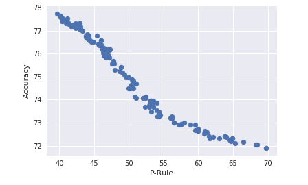

# FairClassifier

**Machine Learning** models are extensively used for the purpose of determining access to services such as eligibility for loans, insurance etc. Despite gains in efficiency of these models, unintentional discrimination flaw of the model has not been fully addressed. 

The Fair Classifier is an open source package that evaluate the fairness of a Neural Network. The goal is to build a command-line playground where user can check the fairness of the model by removing different sensitive attributes from the training data.

### Fairness metrics implemented
> The fairness contraint P% rule is based on [this paper.](https://arxiv.org/pdf/1507.05259.pdf)

### Biasness mitigation implemented
> A neural network is attached with an adversarial network to help mitigate the bias. For further reading please follow this [Link.](https://blog.godatadriven.com/fairness-in-ml)

## Architecture
The overview of the architecture of the model is shown in this figure below:

## Setup
Follow these steps for installation.

### Manual Installation
Clone this repository.

To run the example script, install the additional libraries specified in requirements.txt file as above:

Then change your directory to the Project directory.

Currently, this package works only with 2 sensitive attribute of the dataset i.e race and sex.

The below example is to check the fairness of the model for race attribute.

Steps:

`git clone git@github.com:suraz09/FairClassifier.git`

`pip install -r requirements.txt`

`cd FairClassifier`

`python src/notebooks/main.py race African-American`

## Motivation
This project is inspired by this [Blog.](https://blog.godatadriven.com/fairness-in-ml) 

## Requisites
`python`

For faster results, we used cloud services i.e:
`AWS`

### DataSet
Compas Project [Dataset](https://raw.githubusercontent.com/propublica/compas-analysis/master/compas-scores-two-years.csv)
This dataset is used to predict how likely a criminal defendant is to reoffend. 

THe detailed analysis of the dataset is shown in this [Notebook.](https://github.com/propublica/compas-analysis/blob/master/Compas%20Analysis.ipynb)
 

## Tradeoff
As we move towards making the classifier more fair, we tend to lose the accuracy. There is a tradeoff between accuracy and fairness in this model. The graph below explains the tradeoff in one of the iteration.

